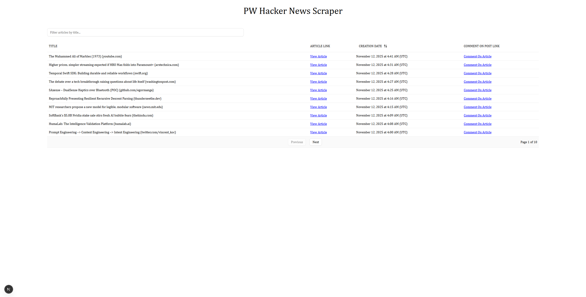
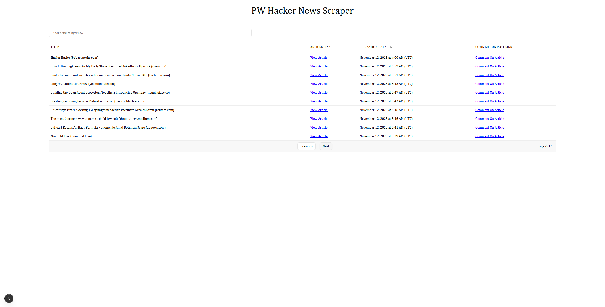
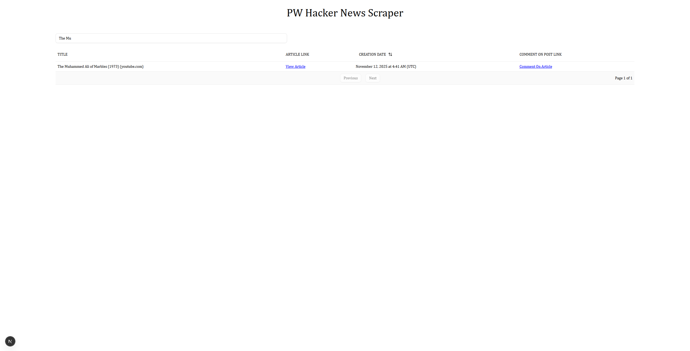
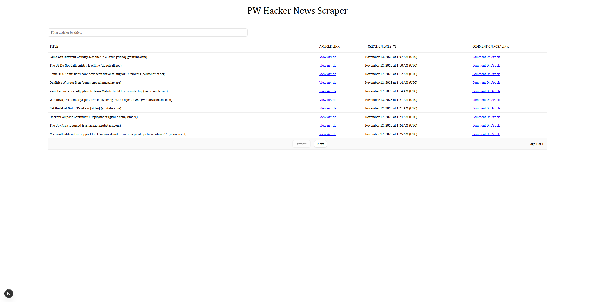
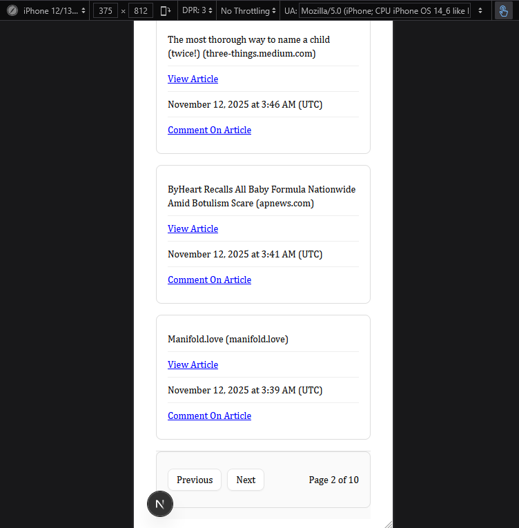

# Playwright Web Scraper

## Setup

### Install Dependencies

```
npm install
```

### Run Locally

```
npm run dev
```

## Features

- Scrapes 100 newest HackerNews articles
- Sorts by date (newest first)
- Search by title
- Responsive design (mobile cards, desktop table)
- TypeScript + Zod validation + Tanstack Query

## Why not deployed?

This project uses Playwright for web scraping, which requires Chromium and only runs locally (not compatible with Vercel's serverless environment). Built as a learning project to practice scraping and data visualization.

## Demo

### Desktop View Page 1



### Desktop View Page Changed



### Desktop View Filtering By Article Title



### Desktop View Sorting Oldest To Newest Articles



### Mobile View


